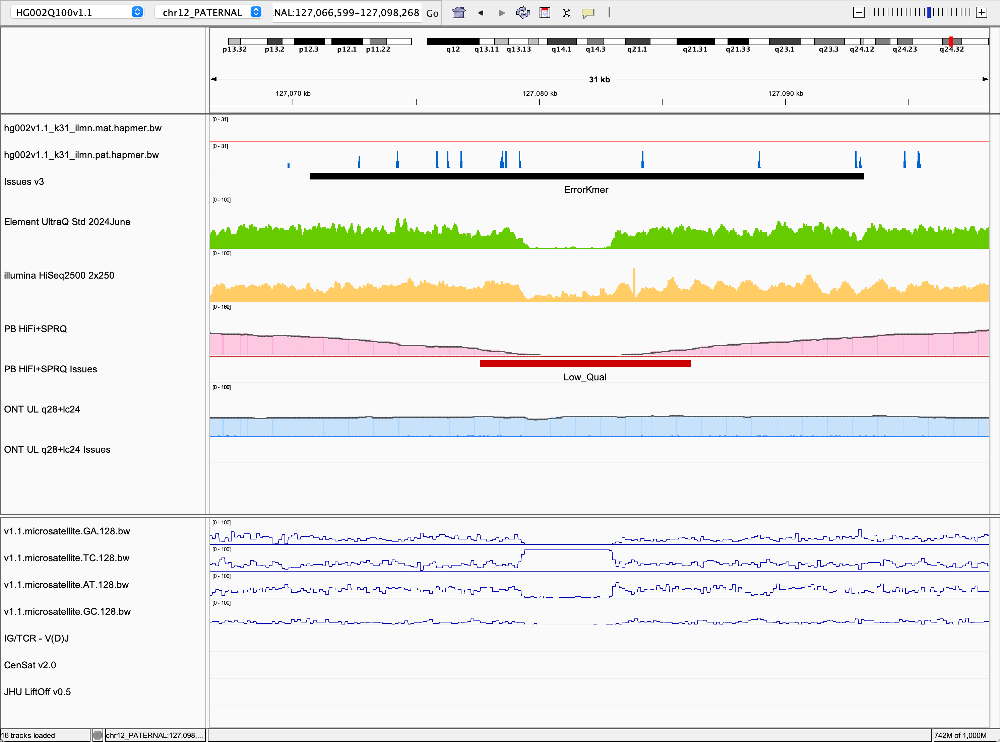
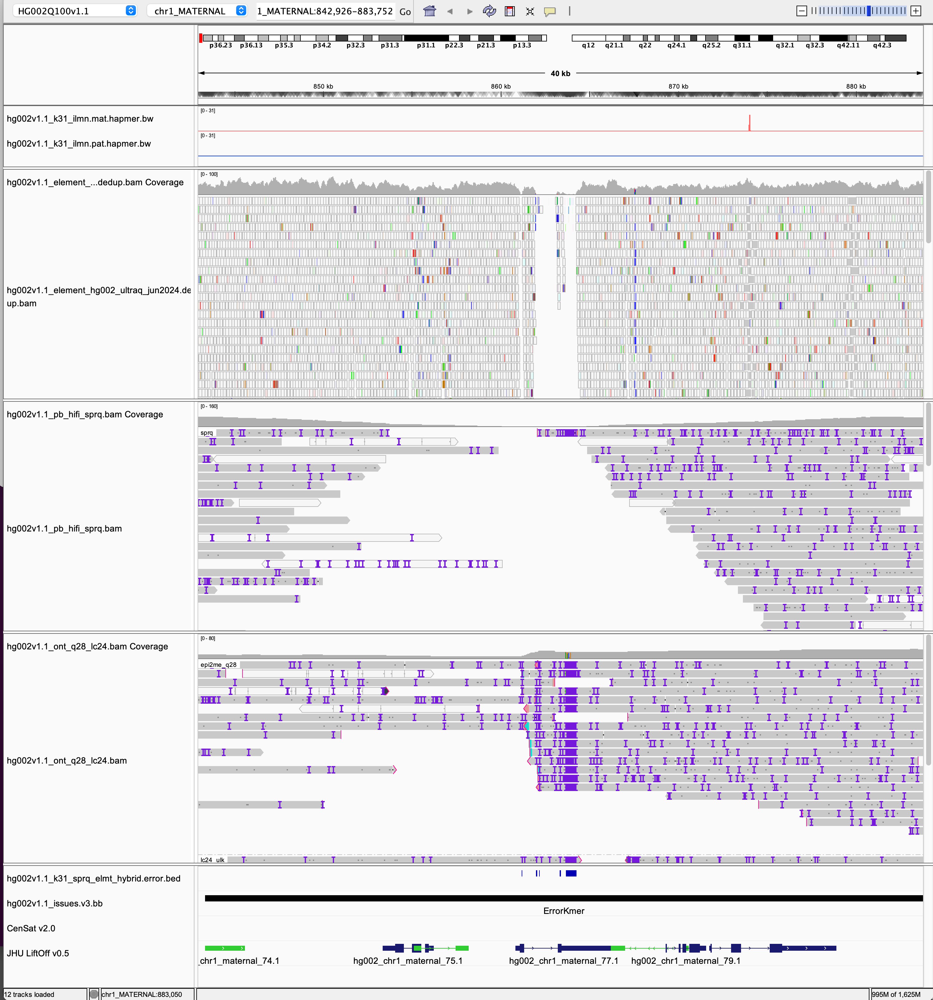

# IGV sessions for curating issues

An IGV genome descriptor has been made for HG002v1.1.

Load the genome first to get the best results. This will load the latest ideogram, gene annotation, and CenSat annotations available.

## Load the genome
On IGV, go to [ Genomes ] -> [ Load Genome from URL ]. Copy below and load the genome.
```
https://raw.githubusercontent.com/marbl/HG002-issues/refs/heads/main/igv_sessions/v1.1/hg002v1.1.json
```

## Overview
The overview session file is located [here](https://github.com/marbl/HG002-issues/blob/main/igv_sessions/v1.1/hg002v1.1_evaluation_overview.xml). Unfortunately, session files needs to be downloaded locally as a file, and loaded from there.
The following tracks are loaded:
* Hapmers from Merqury
* Issues v3
* Element UltraQ Std 2024June
* Illumina HiSeq2500 2x250
* PB HiFi + SPRQ, T2T-Polish issues and NucFlag 1st and 2nd most frequent alleles
* ONT UL q28 + lc24, T2T-Polish issues and NucFlag 1st and 2nd most frequent alleles



## BAM view
The evaluation_bam session is located [here](https://github.com/marbl/HG002-issues/blob/main/igv_sessions/v1.1/hg002v1.1_evaluation_bams.xml).
The following reads will be loaded and groupped by its original source:

* Element UltraQ 2024June

* PacBio
  * hifi
  * sprq

* ONT
  * epi2me_q28
  * lc24_ulk

